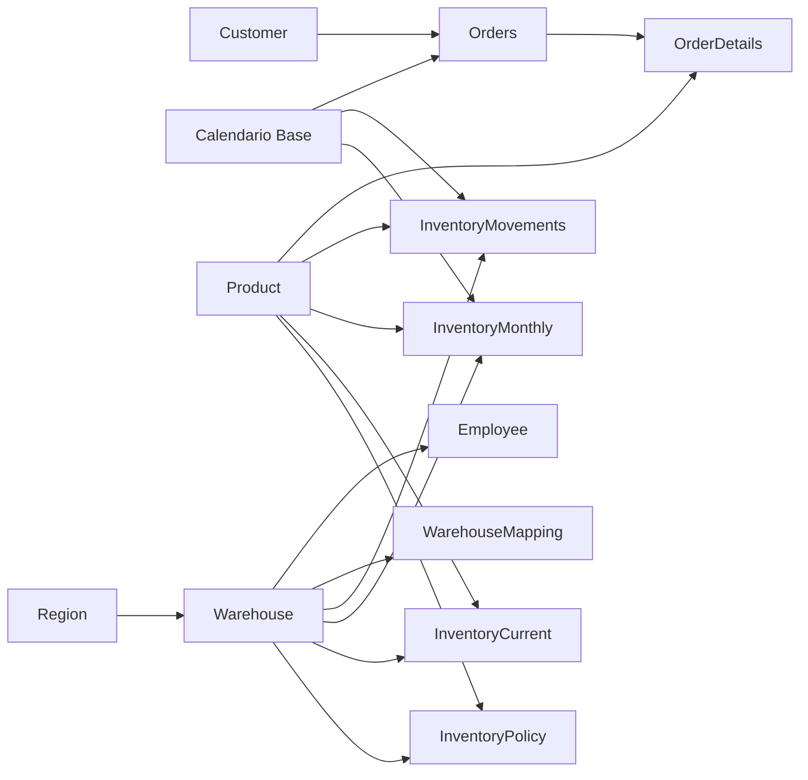

# Inventario simulado: diseño y alcance

Caso de portfolio sin representación de existencias reales. Los siete CSV de `archive/` se conservan íntegros. Su procedencia/licencia aún no está verificada: el script previo de descarga de Kaggle no interviene en este pipeline ni acredita el origen de los archivos.

Los pedidos originales abarcan 21/06/2013–01/11/2017. El inventario es una simulación independiente del 01/01/2017 al 31/12/2017, semilla `28092017`. No se convierten cantidades pedidas en existencias ni se vinculan artificialmente los pedidos con los movimientos. La moneda no está informada: se usa UM (unidad monetaria).

## Preparación

- Customer, Employee, Orders, OrderDetails y Product conservan 400 filas cada una.
- Emails, teléfonos y direcciones personales se excluyen de las tablas analíticas; permanecen en los originales.
- Warehouse se consolida por nombre y dirección: 400 IDs representan 9 ubicaciones. Las claves 1–9 siguen el orden de aparición.
- Region se reduce a esas 9 ubicaciones tomando la primera región asociada a cada depósito. Se corrige el continente según el país (North America, Asia u Oceania). Otros textos y códigos postales no se validan.
- WarehouseMapping conserva las 400 correspondencias entre ID original y depósito consolidado. Employee conserva SourceWarehouseID y recibe la clave consolidada.
- Los nombres de producto repetidos no se fusionan: ProductID sigue siendo el SKU.
- Fechas ISO; tipos numéricos leídos con cultura en-US.

## Reglas reproducibles

Cada uno de los 400 SKU se asigna aleatoriamente a 3 depósitos distintos: 1.200 posiciones. Una posición es un producto en un depósito.

1. Intensidad diaria base de 1–6 unidades; plazo nominal de 3–14 días.
2. Mínimo = intensidad × plazo; objetivo = mínimo + 28 × intensidad.
3. Escenario ponderado: Normal 65%, Demora 15%, Exceso 15%, Sin demanda 5%. Son probabilidades, no cuotas finales garantizadas.
4. Saldo inicial uniforme entre mínimo y objetivo; Exceso comienza con 3 × objetivo.
5. Cada lunes, si el saldo está bajo mínimo, se recibe lo necesario para alcanzar el objetivo. Demora y Sin demanda no reciben reposiciones. Es reposición instantánea simplificada: el plazo nominal solo define el mínimo, no modela compras en tránsito.
6. Demanda diaria uniforme entre cero y 2 × intensidad (cero en Sin demanda). Salida = menor entre demanda y saldo físico. No se almacena demanda no atendida: no hay indicador de nivel de servicio ni ventas perdidas.
7. Se registran Opening, Receipt e Issue con cantidades firmadas. No hay ajustes, transferencias o devoluciones.
8. Cada fin de mes se guarda el saldo, incluido cero. Los saldos no se suman entre meses.
9. Al cierre se reservan entre cero y el menor de saldo o 3 × intensidad. Las reservas son independientes de pedidos Pending originales.
10. Disponible = físico − reservado. Reposición sugerida = objetivo − disponible si disponible < mínimo; de lo contrario, cero.

Estados: Sin stock si disponible = 0; Bajo minimo si 0 < disponible < mínimo; Exceso si disponible > objetivo; Normal en los demás casos. El estado final es distinto del escenario generador.

## Tablas

| Tabla | Filas | Granularidad |
|---|---:|---|
| Customer / Employee / Product | 400 cada una | Cliente / empleado / SKU |
| Orders / OrderDetails | 400 cada una | Pedido / línea original |
| Warehouse / Region | 9 cada una | Ubicación consolidada |
| WarehouseMapping | 400 | ID original de depósito |
| InventoryPolicy | 1.200 | Producto y depósito |
| InventoryMovements | 307.802 | Movimiento de una posición en una fecha |
| InventoryMonthly | 14.400 | Producto, depósito y fin de mes |
| InventoryCurrent | 1.200 | Producto y depósito al 31/12/2017 |
| Calendario Base | 1.826 | Día, 2013–2017 |
| Actualizado al | 1 | Momento de actualización UTC−3 |
| Medidas DAX | — | Contenedor de 17 medidas |

## Relaciones

Las 17 relaciones son activas, muchos a uno y unidireccionales desde la dimensión hacia la dependiente. Muchos a uno se declara también cuando esta muestra contiene solo una fila hija.



InventoryCurrent tiene fecha informativa pero no relación con Calendario: muestra el corte fijo. No hay relaciones entre hechos. Employee no filtra movimientos: no se simula responsable. Los pedidos no se pueden filtrar por depósito.

## Indicadores y páginas

- **Stock al cierre:** físico, disponible, valor a costo estándar, posiciones bajo mínimo y unidades a reponer. Filtros por categoría y depósito.
- **Movimientos:** entradas, salidas y último cierre mensual del contexto. El total de Stock cierre mensual muestra el último cierre, no la suma de meses. Control conciliacion debe dar cero sin filtros exclusivos de una sola tabla de hechos.
- **Pedidos originales:** pedidos y cantidades/importes Shipped. Enviado no acredita facturación. No se presenta Profit como margen realizado.

Valor inventario UM = suma(físico × costo estándar original), constante durante la simulación. No hay FIFO, promedio móvil ni conversión de moneda. Hay costos extremos y 220 detalles de pedido cuyo precio es inferior al costo asociado; se conservan y no se presenta rentabilidad.

Cobertura dias = disponible / (salidas simuladas de los últimos 30 días / 30), vacío si no hay salidas. No es pronóstico: el consumo observado está limitado por disponibilidad y puede subestimar demanda en quiebres.

La página BASE original se conserva oculta como plantilla; se agregan tres páginas con gráficos, tablas y segmentadores.

## Reproducción y validación

```powershell
python scripts/build_inventory.py
python scripts/build_report.py
```

Solo requieren Python estándar. El segundo script sobrescribe las páginas generadas y medidas. `data/prepared/manifest.json` contiene semilla, hashes SHA-256 de fuentes, recuentos y saldos. Los CSV preparados se incluyen en Git para importar sin ejecutar Python.

El generador valida claves únicas, integridad de relaciones, saldo no negativo tras cada movimiento, los 12 cierres de cada posición, cierre final contra movimientos, reservas y disponible.

Esperado sin filtros: físico **61.276**, reservado **4.846**, disponible **56.430**, valor **109.630.923,09 UM**.

## Abrir en Power BI

Abrir `Informe stock.pbip`. Las particiones M importan CSV desde el parámetro `DataRoot`, que apunta a la carpeta absoluta `data/prepared`. El generador configura la ruta del clon automáticamente. En otro equipo, ejecutar el generador o editar el parámetro.

Desde un clon sin caché, ejecutar **Inicio → Actualizar** y guardar. La definición de tablas no equivale por sí sola a datos procesados. La caché se excluye de Git.

La migración inicial cambió Calendario Base de tabla calculada a importada. Una caché anterior provoca `PFE_TM_DDL_CHANGED_PARTITION_FROM_OR_TO_CALC`. Con Power BI cerrado, se respaldó `.pbi/cache.abf` como `.pbi/cache.before-inventory.abf` para reconstruir el modelo desde la definición. Ambos archivos son locales y se excluyen de Git. No se modificaron las fuentes para resolver este error.

`powershell -File scripts/validate_model.ps1` valida la deserialización con las bibliotecas TMDL de Power BI instalado. Es una comprobación de estructura; la importación y las medidas se verifican adicionalmente en Desktop.

Validación de integración realizada el 06/09/2026 en Power BI Desktop 2.153.1206.0: importación completa y consultas DAX contra el motor local. Se comprobaron totales, recuentos de tablas, las 17 medidas, cierres de 12 meses y conciliación para los 9 depósitos y 5 categorías. Resultado en `docs/validacion-powerbi.json`. La caché procesada se guardó localmente. Para repetir con Desktop abierto: `& ./scripts/validate_live_model.ps1 -Port <puerto-local-de-la-instancia>`.

Referencia técnica: [TMDL de Microsoft](https://learn.microsoft.com/en-us/analysis-services/tmdl/tmdl-overview).
